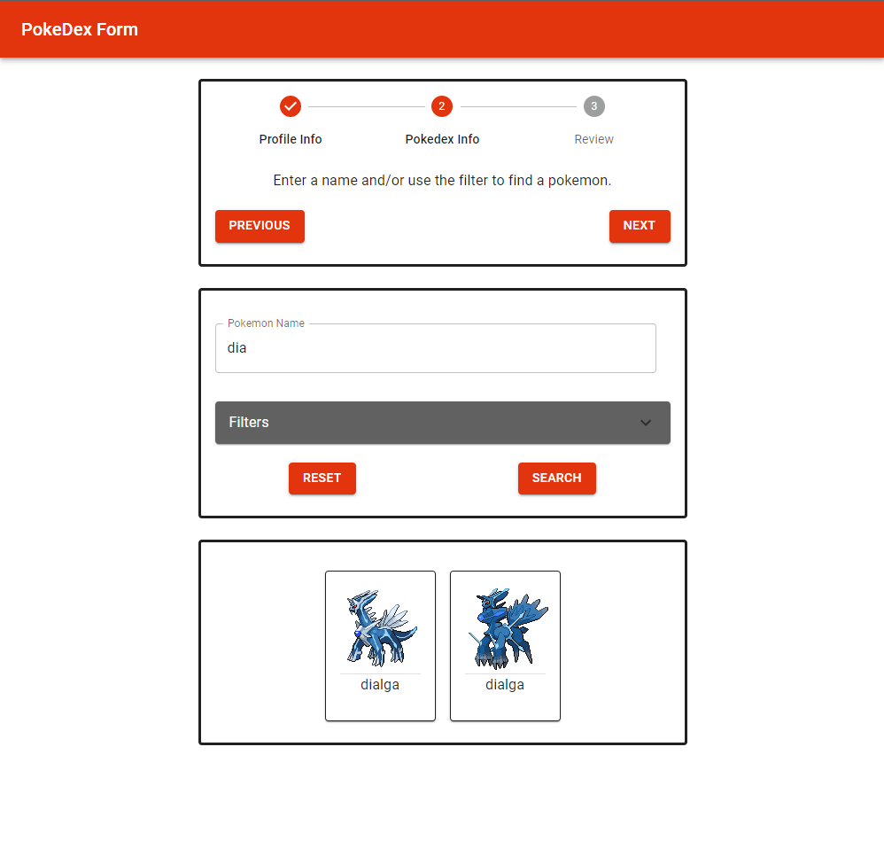
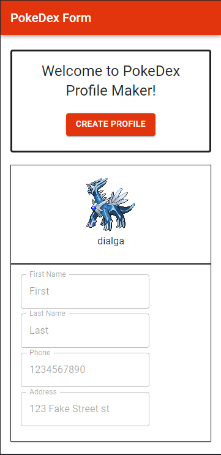

# Pokedex Form

Nascent Digital take home assignment. Built using React and MUI.

Forms have basic validation, as well as regex matching for phone, and progress is stored upon refresh/exit, allowing for bookmarking.

Pokedex step uses pagination to load pokemon data and images. Pokemons can be retrieved using type filters (up to 2 types) and partial name matching. 

## Desktop Images

## Mobile Images

